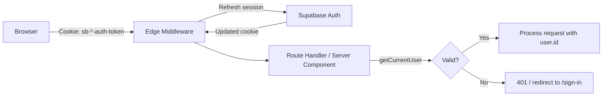

# Auth & Security

## Authentication

### Provider
Supabase Auth with email/password only. No social OAuth providers are configured.

Supported flows:
- Email signup with confirmation link
- Login / logout
- Password reset via email link
- Auth callback handler (`/auth/callback`) for email confirmation and password reset token exchange

See [`api/AUTH_FLOW.md`](../api/AUTH_FLOW.md) for step-by-step flow details.

### Session Management



- Sessions are stored as HTTP-only cookies (managed by `@supabase/ssr`)
- Edge Middleware (`src/middleware.ts` → `src/lib/supabase/middleware.ts`) refreshes the session on every request
- `getCurrentUser()` (`src/lib/auth/server.ts`) reads the refreshed session and returns an `AppUser` or `null`
- In production, `getCurrentUser()` calls `supabase.auth.getUser()` which validates the JWT server-side with Supabase (not just decoded)

### Edge Middleware Behavior

The middleware in `src/lib/supabase/middleware.ts` does three things on every request:

1. **Refreshes the Supabase session cookie** — prevents expiration during active use
2. **Redirects unauthenticated users** from protected paths to `/sign-in`:
   - Protected paths: `/dashboard`, `/projects`, `/ai-chat`, `/settings`, `/usage`
   - The original path is preserved as `?redirectTo=...` for post-login redirect
3. **Redirects authenticated users** away from auth pages (`/sign-in`, `/sign-up`, `/forgot-password`) to `/dashboard`

In mock auth mode (`USE_MOCK_AUTH=true` in development), the middleware skips all Supabase checks and passes the request through.

### Protected Routes

Two protection mechanisms:

- **Server components**: Call `getCurrentUser()` and redirect to `/sign-in` if null. The middleware usually catches this first, but server components provide a second layer.
- **API route handlers**: Call `getCurrentUser()` and return `{ error: "Unauthorized" }` with status 401.

### Mock Auth (Development Only)

When `USE_MOCK_AUTH=true` **and** `NODE_ENV !== "production"`:
- `getCurrentUser()` returns a hardcoded `DEV_USER` (defined in `src/lib/auth/constants.ts`)
- No Supabase session cookie is needed
- All API routes work without a running Supabase instance
- Middleware skips session refresh and route protection

**Hard-blocked in production**: `src/lib/env.ts` throws a fatal error if `USE_MOCK_AUTH=true` is set when `NODE_ENV=production`.

## Authorization

### Row-Level Security (RLS)
Every table has PostgreSQL RLS policies:
```sql
CREATE POLICY "users_select_own" ON projects
  FOR SELECT USING (auth.uid() = user_id);
```

This is the **database-level** access control layer. It runs inside PostgreSQL — even if application code has a bug or the wrong query, RLS prevents cross-user data access.

### Application-Level Ownership Checks
In addition to RLS, every query explicitly filters by `user_id`:
```typescript
.eq("user_id", user.id)
```
This is defense-in-depth. Both layers must agree. The application-level check exists because:
- It makes ownership semantics explicit in code (reviewable, debuggable)
- It provides clearer 404 responses (RLS silently returns empty results)

### Shared Ownership Helper

A shared helper exists for verifying project ownership (`src/lib/auth/verify-project-ownership.ts`):
```typescript
import { verifyProjectOwnership } from "@/lib/auth/verify-project-ownership";

const isOwner = await verifyProjectOwnership(projectId, user.id);
if (!isOwner) return { success: false, error: "Project not found or access denied." };
```
Used by: feedback actions (create/delete/update), Decision Engine service layer (via `requireProjectOwnership` wrapper).

### Project Ownership for AI Routes
AI routes verify ownership inline because they also need the full project row for AI context:
```typescript
const { data: project } = await supabase
  .from("projects").select("name, description, ...")
  .eq("id", projectId).eq("user_id", user.id).single();
if (!project) return NextResponse.json({ error: "Project not found" }, { status: 404 });
```
The 404 response is intentionally identical whether the project doesn't exist or belongs to another user — prevents resource enumeration.

### Child Table Ownership

Tables without `user_id` (legacy `decisions`, `roadmaps`, `feedback_documents`, `project_context`) inherit ownership through `project_id → projects.user_id`. Mutations on these tables must verify parent project ownership first.

Tables with `user_id` (`product_decisions`, `product_decision_options`, `product_assumptions`, `product_evidence`, `ai_usage`, `global_chat_messages`) are filtered directly by `user_id`.

### Admin Detection
```typescript
// src/lib/ai/rate-limiter.ts
export function isAdminUser(user: AppUser): boolean {
  if (!user.email) return false;
  return getAdminEmails().has(user.email.trim().toLowerCase());
}
```
- `ADMIN_EMAILS` env var: comma-separated list, server-side only (no `NEXT_PUBLIC_` prefix)
- Currently used **only** for rate limit bypass — admins skip AI rate limits
- No admin UI, no admin dashboard, no elevated data access

## Security Measures

| Layer | Implementation | Source |
|---|---|---|
| Auth cookies | HTTP-only, Secure, SameSite=Lax | Managed by `@supabase/ssr` |
| Session refresh | Edge Middleware on every request | `src/lib/supabase/middleware.ts` |
| Route protection | Middleware redirects + server component checks | `middleware.ts`, server pages |
| RLS | Every table, every operation | Supabase PostgreSQL policies |
| Ownership checks | Explicit `user_id` filter in every query | All route handlers + services |
| Rate limiting | Per-user, two tiers (standard + heavy) | `src/lib/ai/rate-limiter.ts` |
| API key protection | `OPENAI_API_KEY` is server-side only | Never in `NEXT_PUBLIC_*` |
| Input validation | Zod schemas on all mutating endpoints | Route files + `lib/decisions/schemas.ts` |
| Mock auth blocking | `USE_MOCK_AUTH=true` throws in production | `src/lib/env.ts` |
| localhost blocking | `NEXT_PUBLIC_SITE_URL=localhost` throws in production | `src/lib/env.ts` |
| Mock AI blocking | `USE_REAL_AI=false` throws in production | `src/lib/env.ts` |
| Service role key | Used only for account deletion | `src/app/api/account/delete/route.ts` (via service-role client from `src/lib/supabase/server.ts`) |
| Error sanitization | API keys stripped from error messages | `src/lib/errors.ts`, `src/lib/ai/usage-tracking.ts` |

## Account Deletion

`POST /api/account/delete`:
1. Authenticates via session cookie
2. Deletes all child records across ~15 tables in dependency order using the Supabase service role key (bypasses RLS)
3. Deletes all projects
4. Deletes user-level records (ai_usage, global_chat_messages)
5. Calls `auth.admin.deleteUser()` to remove the Supabase Auth account
6. Returns `{ success: true }`

This is the **only** endpoint that uses the service role key.

## Known Limitations

- **No CSRF protection beyond SameSite cookies.** SameSite=Lax on auth cookies provides basic CSRF protection but is not a complete defense.
- **No IP-based blocking or CAPTCHA.** Rate limiting is per-user only. Unauthenticated request floods are only mitigated by the auth check returning 401 before expensive work.
- **No secret rotation playbook.** No documented procedure for rotating `OPENAI_API_KEY` or `SUPABASE_SERVICE_ROLE_KEY`.
- **No audit log.** Sensitive operations (account deletion, admin bypass) are logged to console but not to a persistent audit table.
- **Admin is rate-limit-only.** There is no admin role in the database, no admin UI, and no elevated data access. "Admin" means "rate limits don't apply."
