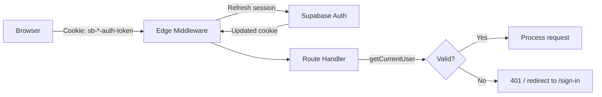

# Auth & Security

## Authentication

### Provider
Supabase Auth with email/password. Supports:
- Email signup with confirmation
- Login / logout
- Password reset via email
- OAuth callback handling

### Session Management



- Sessions are stored as HTTP-only cookies
- Edge Middleware refreshes the session on every request
- `getCurrentUser()` extracts the user from the refreshed session
- Mock auth is available in development (`USE_MOCK_AUTH=true`) but hard-blocked in production

### Protected Routes
Server components call `getCurrentUser()` and redirect to `/sign-in` if null. API routes return 401.

## Authorization

### Row-Level Security (RLS)
Every table has PostgreSQL RLS policies:
```sql
CREATE POLICY "users_select_own" ON projects
  FOR SELECT USING (auth.uid() = user_id);
```

### Application-Level Ownership Checks
In addition to RLS, every query explicitly filters by `user_id`:
```typescript
.eq("user_id", user.id)
```
This is defense-in-depth — both layers must agree.

### Admin Detection
```typescript
// lib/auth/admin.ts
export function isAdminUser(email: string): boolean {
  const adminEmails = process.env.ADMIN_EMAILS?.split(",") ?? [];
  return adminEmails.includes(email.toLowerCase());
}
```
Admin status is checked server-side only. Never exposed to the client.

## Security Measures

| Layer | Implementation |
|---|---|
| Auth cookies | HTTP-only, Secure, SameSite=Lax |
| Session refresh | Edge Middleware on every request |
| RLS | Every table, every operation |
| Ownership checks | Explicit `user_id` filter in queries |
| Rate limiting | Per-user, per-feature |
| API key protection | OpenAI key is server-side only, never sent to client |
| Mock auth blocking | `USE_MOCK_AUTH=true` throws in production |
| localhost blocking | `NEXT_PUBLIC_SITE_URL=localhost` throws in production |
| Service role key | Used only for admin operations (account deletion) |
| Input validation | Zod schemas on all mutating endpoints |

## Account Deletion
`POST /api/account/delete` uses the Supabase service role key to delete all user data across all tables, then signs the user out. This is the only endpoint that uses the service role key.

