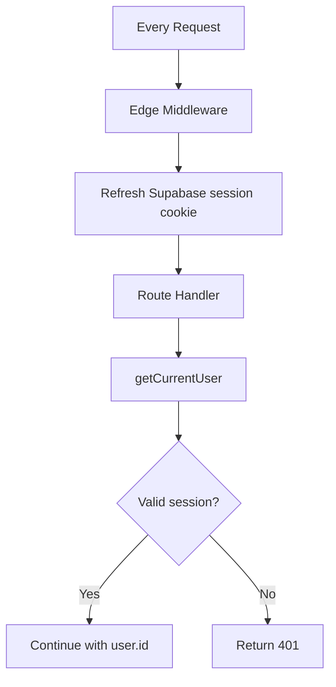

# Backend Architecture

## Overview

ProductMind's backend is implemented as Next.js API Route Handlers in `src/app/api/` with a modular service layer in `src/lib/`. This document explains the patterns, conventions, and design rationale for a developer coming from a frontend background.

## API Route Handlers

Next.js Route Handlers are server-side functions that receive HTTP requests and return responses. They are functionally equivalent to Express.js route handlers but colocated with the frontend code.

**Location**: `src/app/api/[...path]/route.ts`

**Convention**: Each file exports named functions matching HTTP methods:
```typescript
export async function GET(req: Request) { ... }
export async function POST(req: Request) { ... }
export async function PATCH(req: Request) { ... }
export async function DELETE(req: Request) { ... }
```

### Common Pattern (every AI route)

```typescript
export async function POST(req: Request) {
  // 1. Authentication
  const user = await getCurrentUser();
  if (!user) return NextResponse.json({ error: "Unauthorized" }, { status: 401 });

  // 2. Rate limiting
  const rl = await checkHeavyAILimit(user, "decision_review");
  if (!rl.allowed) return rateLimitResponse(rl);

  // 3. Input validation (Zod)
  const body = await req.json();
  const parsed = schema.safeParse(body);
  if (!parsed.success) return NextResponse.json({ error: "Invalid input" }, { status: 400 });

  // 4. Authorization (ownership check via RLS + explicit query)
  const { data: project } = await supabase
    .from("projects")
    .select("id")
    .eq("id", projectId)
    .eq("user_id", user.id)  // ownership check
    .single();
  if (!project) return NextResponse.json({ error: "Not found" }, { status: 404 });

  // 5. Business logic (AI call, DB operations, etc.)
  // ...

  // 6. Usage tracking (non-blocking)
  void trackAIUsage({ userId, feature, tokens, ... });

  // 7. Structured response
  return NextResponse.json({ result }, { status: 200 });
}
```

## Service Layer (`src/lib/`)

The service layer contains reusable backend logic separated from HTTP concerns. Route handlers are thin — they validate, authorize, then delegate to services.

### Module Boundaries

| Module | Responsibility | Key Files |
|---|---|---|
| `lib/ai/` | Rate limiting, usage tracking, pricing config, mock detection | `rate-limiter.ts`, `usage-tracking.ts`, `pricing.ts` |
| `lib/auth/` | User session management, admin detection, mock auth | `server.ts`, `constants.ts`, `client.ts` |
| `lib/decisions/` | Decision CRUD, AI review orchestration, schema validation | `service.ts`, `decision-review-service.ts`, `review-schemas.ts`, `review-normalize.ts` |
| `lib/evidence/` | Evidence retrieval abstraction, citation generation | `retrieval-service.ts`, `citations.ts`, `types.ts` |
| `lib/rag/` | Document chunking, embedding, vector search, context building | `chunker.ts`, `embeddings.ts`, `vector-search.ts`, `context-builder.ts` |
| `lib/supabase/` | Database client creation (server/client/middleware) | `server.ts`, `client.ts`, `middleware.ts` |

### Why Not Express/Fastify?

Next.js Route Handlers provide the same capabilities (request parsing, response building, middleware) while keeping the codebase unified. For an MVP, this eliminates the overhead of separate API deployment, CORS configuration, and service discovery.

## Authentication Flow



- **Edge Middleware** (`src/middleware.ts`): Runs on every request. Refreshes the Supabase auth session cookie so it doesn't expire during active use.
- **`getCurrentUser()`**: Called at the start of every protected route. Returns the authenticated user or null.
- **RLS (Row-Level Security)**: Even if auth is bypassed, Supabase RLS policies prevent accessing other users' data at the database level. This is defense-in-depth.

## Rate Limiting

Implemented in `lib/ai/rate-limiter.ts` using an in-memory sliding window algorithm.

| Tier | Limit | Features |
|---|---|---|
| Standard | 20 requests / hour | Chat, Insights, Feature Scoring, Prioritization |
| Heavy | 5 requests / 15 min | PRD, Roadmap, Competitive Analysis, Decision Review, Multi-Agent |

- **Admin bypass**: Users whose email is in `ADMIN_EMAILS` env var skip rate limits.
- **Limitation**: In-memory state resets on serverless cold start. Acceptable for MVP; Redis/Upstash is the planned upgrade.

## Usage Tracking

Every AI operation records telemetry to the `ai_usage` table via `trackAIUsage()`:

```typescript
void trackAIUsage({
  userId,
  projectId,
  model: "gpt-4o",
  feature: "decision_review",
  promptTokens: 1500,
  completionTokens: 800,
  isMock: false,
  latencyMs: 3200,
  metadata: { decisionId, evidenceCount, confidenceScore },
});
```

The `void` prefix makes tracking non-blocking — if tracking fails, the user's request still succeeds.

## Error Handling

| Status | Meaning | When |
|---|---|---|
| 400 | Bad Request | Zod validation failed, missing required fields |
| 401 | Unauthorized | No valid session |
| 404 | Not Found | Resource doesn't exist or user doesn't own it |
| 429 | Too Many Requests | Rate limit exceeded |
| 502 | Bad Gateway | OpenAI returned invalid/unparseable response |
| 500 | Internal Error | Unexpected server error |

All error responses follow a consistent shape:
```json
{ "error": "Human-readable error message" }
```

## Structured AI Output Handling

AI responses (especially Decision Review) go through a validation pipeline:

```
OpenAI JSON response
    → JSON.parse()
    → normalizeDecisionReviewOutput()  // snake_case → camelCase, type aliases, string→number
    → decisionReviewOutputSchema.safeParse()  // Zod validation
    → if invalid: retry with correction prompt (max 1 retry)
    → sanitizeCitationIds()  // remove hallucinated citation references
    → save to database
```

This is necessary because LLMs don't reliably produce valid JSON matching a specific schema. The normalization layer handles common AI output variations so the Zod schema can be strict.

## Environment & Config

- `lib/env.ts`: Validates required environment variables at startup. Blocks production deployment with `localhost` URLs.
- `lib/ai/is-real-ai.ts`: Checks `USE_REAL_AI` flag to toggle mock/real AI.
- `lib/auth/constants.ts`: Guards mock auth flags so they can never activate in production.
- `lib/url.ts`: `getSiteUrl()` resolves the correct URL for Vercel preview, production, or local dev.

