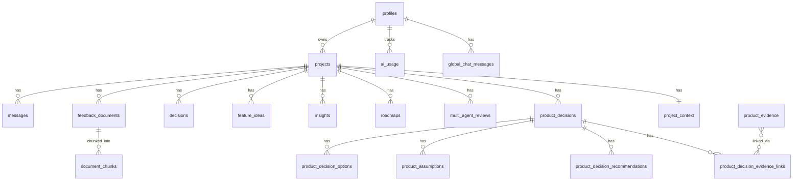

# Data Model

## Overview

ProductMind uses ~20 PostgreSQL tables in Supabase, organized into five domains:
1. **Core** — projects, context, profiles
2. **AI Output Storage** — generated documents, insights, roadmaps, reviews
3. **Decision Engine** — structured decisions with options, assumptions, evidence, recommendations
4. **RAG / Evidence** — feedback documents, embedding chunks
5. **Telemetry / Chat** — usage tracking, chat history

Two naming conventions coexist: the legacy `decisions` table (stores PRDs and analyses) is unrelated to the `product_decisions` table (Decision Engine). This is a known naming issue documented below.

## Table Map

---

## 1. Core Tables

### `profiles`
User profile, synced from Supabase Auth. Created automatically on signup via a database trigger.

### `projects`
Central entity. Every AI feature is scoped to a project.

| Column | Type | Purpose |
|---|---|---|
| `id` | uuid (PK) | |
| `user_id` | uuid (FK → auth.users) | Owner |
| `name` | text | Project name (required) |
| `description` | text | Brief description |
| `target_users` | text | Who the product serves |
| `market` | text | Industry/geography |
| `business_model` | text | Revenue model |
| `goals` | text | Product goals |
| `created_at`, `updated_at` | timestamptz | |

These metadata fields are injected into AI prompts as project context.

### `project_context`
Structured context from the Context Builder page. One row per project (1:1 relationship).

| Column | Purpose |
|---|---|
| `product_overview` | Detailed product description |
| `target_personas` | User personas |
| `current_metrics` | Current KPIs/metrics |
| `pain_points` | Known customer pain points |
| `competitors` | Competitor names/descriptions |
| `strategic_goals` | Strategic objectives |
| `constraints` | Technical/business constraints |
| `open_questions` | Unresolved questions |

All fields are optional text. When present, they enrich AI prompts for chat, insights, roadmap, and decision review.

---

## 2. AI Output Storage

### `decisions` (legacy naming)
**This table stores generated documents (PRDs, competitive analyses, prioritization results). It is NOT related to `product_decisions`.**

| Column | Type | Purpose |
|---|---|---|
| `id` | uuid (PK) | |
| `project_id` | uuid (FK) | |
| `type` | text | `"PRD"`, `"COMPETITIVE_ANALYSIS"`, `"PRIORITIZATION"` |
| `input` | jsonb | What the user submitted (product name, description, etc.) |
| `output` | jsonb | AI-generated content (`{ content: "markdown..." }`) |
| `created_at` | timestamptz | |

**Why "decisions"?** This was the original table name from an early app version. It should be renamed to `generated_documents` or `ai_artifacts` but remains for backward compatibility.

### `insights`
AI-generated strategic insights. Regenerated each time — old rows are deleted and new ones inserted.

| Column | Purpose |
|---|---|
| `title` | Insight headline |
| `type` | `risk`, `opportunity`, `next_action`, `roadmap`, `assumption`, `pain_point`, `strategic_gap` |
| `explanation` | 2-3 sentence explanation |
| `priority` | `critical`, `high`, `medium`, `low` |
| `confidence` | `high`, `medium`, `low` |
| `suggested_action` | Recommended next step |

### `roadmaps`
Generated roadmap data. One active roadmap per project (old roadmap deleted on regeneration).

Stored as JSON columns containing `now`, `next`, `later`, `plan_30_days`, `plan_60_days`, `plan_90_days`, `risks`, `dependencies`, `success_metrics` arrays.

### `multi_agent_reviews`
Multi-persona review output. Contains the full JSON response from the 4-persona AI review (PM, CTO, UX, Growth perspectives + consensus).

### `feature_ideas`
User-created feature ideas with optional AI-generated scoring.

| Column | Purpose |
|---|---|
| `name`, `description` | Feature identity |
| `reach`, `impact`, `confidence`, `effort` | RICE scoring dimensions (1-10, AI-generated) |
| `rice_score`, `ice_score` | Calculated composite scores |
| `ai_commentary` | AI explanation of scoring rationale |

Scores are `NULL` until the user runs AI scoring (`/api/ai/score-features`).

---

## 3. Decision Engine Tables (`product_*`)

These 7 tables form a **normalized data model** for structured product decisions. They are separate from the legacy `decisions` table above.

### `product_decisions`
The decision record itself.

| Column | Purpose |
|---|---|
| `title` | Decision title (3-200 chars) |
| `category` | `product`, `technical`, `growth`, `ux`, `business`, `strategy`, `other` |
| `status` | `draft`, `under_review`, `accepted`, `rejected`, `revisit` |
| `problem_statement` | What problem this decision addresses (10-5000 chars) |
| `context_summary` | Optional additional context |
| `confidence_score` | 0-100, updated after AI analysis |
| `selected_option_id` | FK to chosen option (nullable) |

### `product_decision_options`
3-4 options generated per AI analysis.

| Column | Purpose |
|---|---|
| `title`, `description` | Option identity |
| `pros`, `cons`, `risks` | String arrays |
| `effort_estimate` | `low`, `medium`, `high`, `unknown` |
| `reversibility` | `low`, `medium`, `high`, `unknown` |
| `confidence_score` | 0-100 |
| `expected_impact` | Text (⚠️ stored but not shown in UI) |
| `generated_by` | `"decision_review_v1"` or `NULL` (legacy) |

### `product_assumptions`
Assumptions underlying the decision.

| Column | Purpose |
|---|---|
| `statement` | The assumption text |
| `assumption_type` | `market`, `user`, `technical`, `growth`, `pricing`, `ux`, `business`, `other` |
| `type` | ⚠️ **Duplicate of `assumption_type`** — same value, added by alignment migration |
| `risk_level` | `low`, `medium`, `high` |
| `evidence_status` | `unsupported`, `weak`, `moderate`, `strong` |
| `validation_method` | Suggested way to validate |
| `result` | ⚠️ **Always NULL** — intended for future validation tracking |
| `generated_by` | `"decision_review_v1"` or `NULL` |

### `product_evidence`
Evidence records created from RAG retrieval during analysis.

| Column | Purpose |
|---|---|
| `title` | Evidence title (from source document) |
| `claim` | The relevant text snippet |
| `content` | Full chunk content |
| `source_type` | `feedback`, `document`, `research`, `ai_generated`, etc. |
| `source_id` | FK to source document (nullable) |
| `relevance_score` | 0-1 cosine similarity score |
| `generated_by` | `"decision_review_v1"` or `NULL` |

### `product_decision_evidence_links`
Join table linking evidence to decisions (many-to-many).

| Column | Purpose |
|---|---|
| `decision_id` | FK to `product_decisions` |
| `evidence_id` | FK to `product_evidence` |
| `link_type` | `supports`, `contradicts`, `informs`, `weakens`, `validates`, `invalidates` |

### `product_decision_recommendations`
The AI's recommendation. One active recommendation per decision.

| Column | Purpose |
|---|---|
| `recommendation` | Recommendation text |
| `reasoning` | Newline-joined reasoning points |
| `next_validation_steps` | Suggested validation steps |
| `confidence_score` | 0-100 |
| `supporting_evidence` | ⚠️ Stored but not shown in UI (overlaps Evidence section) |
| `assumptions` | ⚠️ Stored but not shown in UI (overlaps Assumptions section) |
| `risks` | ⚠️ Stored but not shown in UI |
| `alternatives` | ⚠️ Stored but not shown in UI |
| `next_steps` | ⚠️ **Dead column** — never written by Decision Review |
| `generated_by` | `"decision_review_v1"` or `NULL` |

### `product_decision_agent_reviews`
⚠️ **Reserved / unused.** Exists in the schema but no code writes to it. Intended for future multi-agent Decision Review.

---

## 4. RAG / Evidence Tables

### `feedback_documents`
User-uploaded research documents (interview transcripts, survey results, support tickets). Text content is extracted and used as the RAG source.

### `document_chunks`
Chunks of feedback documents with embedding vectors for pgvector similarity search.

| Column | Type | Purpose |
|---|---|---|
| `content` | text | Raw text of the chunk (~500 chars) |
| `embedding` | vector(1536) | Semantic embedding (pgvector) |
| `document_id` | uuid FK | Source feedback document |
| `project_id` | uuid FK | Project scope for search filtering |
| `chunk_index` | integer | Position within the document |

Chunks are created when a feedback document is saved — the text is split into ~500 character chunks with ~50 character overlap, embedded via OpenAI `text-embedding-3-small`, and stored with their vectors.

---

## 5. Telemetry & Chat Tables

### `ai_usage`
Operational log of every AI action. **Not the same as saved outputs** — this is telemetry.

| Column | Purpose |
|---|---|
| `user_id` | Who made the request |
| `project_id` | Which project (nullable for global chat) |
| `feature` | `chat`, `prd`, `competitive_analysis`, `insights`, `roadmap`, `multi_agent_review`, `decision_review`, `feature_prioritization`, `document_embedding`, `query_embedding`, `rag_search` |
| `model` | `gpt-4o`, `mock`, etc. |
| `prompt_tokens`, `completion_tokens`, `total_tokens` | Token counts |
| `input_cost`, `output_cost`, `estimated_cost` | Calculated cost in USD |
| `is_mock` | Whether this was a mock response |
| `status` | `success` or `error` |
| `error_message` | Sanitized error text (API keys stripped) |
| `latency_ms` | Request duration |
| `metadata` | Feature-specific JSON (decisionId, evidenceCount, etc.) |

### `messages`
Per-project AI chat history. Each row is one message (role: `user` or `assistant`).

### `global_chat_messages`
Global AI Assistant chat history. Same structure as `messages` but scoped to `user_id` instead of `project_id`.

---

## RLS (Row-Level Security)

Every table has RLS policies ensuring:
- Users can only SELECT/INSERT/UPDATE/DELETE their own rows
- All policies filter by `auth.uid() = user_id` (directly or via project ownership)
- The Supabase service role key bypasses RLS — used only for account deletion

---

## Legacy Fields & Cleanup Notes

| Item | Table | Issue |
|---|---|---|
| `next_steps` column | `product_decision_recommendations` | **Dead** — never written by Decision Review. `next_validation_steps` is the active column. |
| `type` column | `product_assumptions` | **Duplicate** of `assumption_type`. Both store the same value. |
| `result` column | `product_assumptions` | **Always NULL**. Intended for future validation outcomes. |
| `expected_impact` | `product_decision_options` | Stored but hidden from UI. |
| `supporting_evidence`, `risks`, `alternatives` | `product_decision_recommendations` | Stored but hidden from UI — overlap with structured sections. |
| `product_decision_agent_reviews` | Entire table | **Unused** — reserved for future feature. |
| `decisions` table name | `decisions` | Misleading — stores generated documents, not product decisions. |

See [`roadmap/TECHNICAL_DEBT_AND_FUTURE_IMPROVEMENTS.md`](../roadmap/TECHNICAL_DEBT_AND_FUTURE_IMPROVEMENTS.md) for the full cleanup plan.
