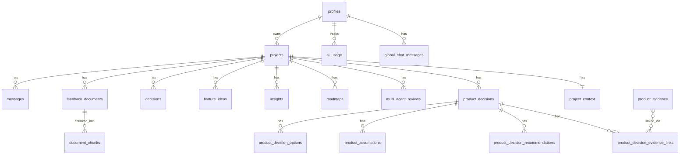

# Data Model

## Table Map

## Core Tables

### `profiles`
User profile, synced from Supabase Auth. Created automatically on signup.

### `projects`
Central entity. Every AI feature is scoped to a project.

| Column | Purpose |
|---|---|
| `name`, `description` | Basic identity |
| `target_users`, `market`, `business_model`, `goals` | Context for AI tools |

### `project_context`
Structured context from the Context Builder (8 sections: product overview, personas, metrics, pain points, competitors, goals, constraints, open questions). One row per project.

## AI Output Storage

### `decisions` (legacy)
Stores generated PRDs, competitive analyses, and prioritization outputs. Each row has `type`, `input` (JSON), and `output` (JSON text).

**Used by**: PRD Generator, Competitive Analysis, Feature Prioritization.

### `insights`
AI-generated strategic insights (risks, opportunities, actions). Regenerated each time (old rows deleted, new inserted).

### `roadmaps`
Generated roadmap data (phases, priorities, timeline).

### `multi_agent_reviews`
Multi-persona review output (PM, CTO, UX, Growth perspectives + consensus).

## Decision Engine Tables (`product_*`)

These 7 tables form the Decision Engine — a normalized data model for structured product decisions.

### `product_decisions`
The decision itself (title, category, status, problem statement, context, confidence score).

### `product_decision_options`
3-4 options generated per analysis. Each has title, description, pros, cons, risks, effort estimate, reversibility, confidence score.

### `product_assumptions`
Assumptions underlying the decision. Each has a type (market/user/technical/etc.), risk level, evidence status, and optional validation method.

### `product_evidence`
Evidence records created from RAG retrieval during analysis. Contains the chunk snippet, source type, relevance score.

### `product_decision_evidence_links`
Join table linking evidence to decisions (many-to-many).

### `product_decision_recommendations`
The AI's recommendation with reasoning, supporting evidence, next validation steps, and confidence score. One active recommendation per decision.

### `product_decision_agent_reviews`
Reserved for future multi-agent Decision Review (not yet implemented).

## RAG / Evidence Tables

### `feedback_documents`
User-uploaded research documents (interview transcripts, survey results, support tickets).

### `document_chunks`
Chunks of feedback documents with embedding vectors. Used for pgvector similarity search.

| Column | Purpose |
|---|---|
| `content` | Raw text of the chunk |
| `embedding` | 1536-dim vector (pgvector) |
| `document_id` | Source feedback document |
| `project_id` | Project scope for search filtering |

## Telemetry Tables

### `ai_usage`
Operational log of every AI action. Records model, feature, tokens, cost, latency, status, and metadata.

**Not the same as saved outputs.** This is telemetry — it records that an action happened, not what was generated.

## Chat Tables

### `messages`
Per-project AI chat history (role: user/assistant).

### `global_chat_messages`
Global AI Assistant chat history (not project-scoped).

## Feature Tables

### `feature_ideas`
User-created feature ideas with optional AI-generated RICE/ICE scores.

## RLS (Row-Level Security)

Every table has RLS policies ensuring:
- Users can only SELECT/INSERT/UPDATE/DELETE their own rows
- All policies filter by `auth.uid() = user_id`
- Service role key bypasses RLS (used only for admin operations like account deletion)

