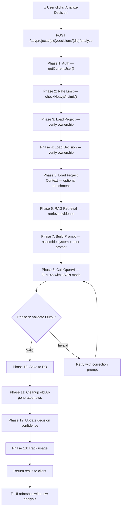
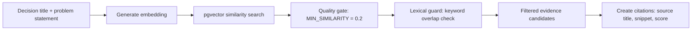
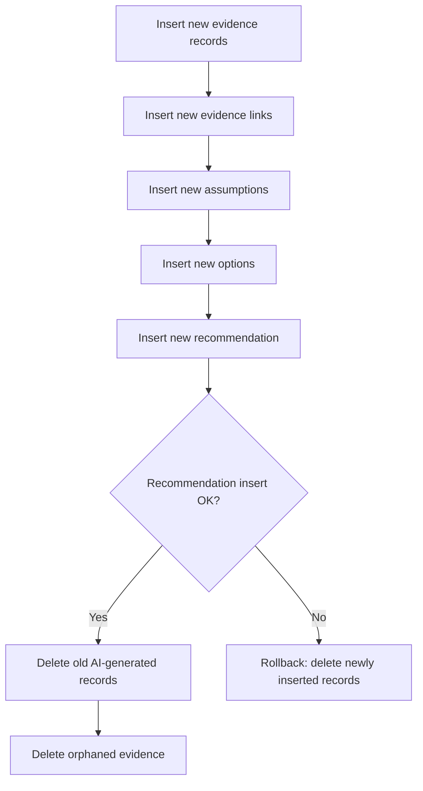

# Decision Review — Orchestration Flow

The Decision Review is ProductMind's most complex AI workflow. When a user clicks "Analyze Decision", a multi-phase pipeline executes server-side.

## Flow Diagram



## Phase Details

### Phase 1–2: Auth & Rate Limiting
Standard guards. User must be authenticated. Heavy AI rate limit applies (5 per 15 min).

### Phase 3–4: Load Project & Decision
Both queries include `user_id` filter for ownership verification. If either is missing or doesn't belong to the user, the request fails with 404.

### Phase 5: Load Project Context
Optional enrichment from `project_context` table. If the user filled in the Context Builder (product overview, personas, metrics, pain points, competitors, goals, constraints, open questions), this data enriches the prompt.

### Phase 6: RAG Retrieval (Evidence Layer)



The evidence retrieval uses the Evidence Layer (`lib/evidence/`) which wraps the RAG pipeline with intent-specific configuration. For decision review, it searches for document chunks relevant to the decision's title and problem statement.

### Phase 7: Prompt Construction
Assembles a structured prompt with:
- Decision details (title, category, status, problem statement)
- Project context (name, description, users, market, goals)
- Detailed context (if available from Context Builder)
- Retrieved evidence with citation IDs
- Output format specification (exact JSON schema)
- Constraint rules (valid assumption types, citation usage)

### Phase 8: OpenAI Call
- Model: GPT-4o
- Temperature: 0.5 (first attempt), 0.3 (retry)
- Max tokens: 4096
- Response format: `json_object` (forces valid JSON)

### Phase 9: Validation Pipeline

```
Raw JSON string
    → JSON.parse()
    → normalizeDecisionReviewOutput()
        - snake_case → camelCase (confidence_score → confidenceScore)
        - Type alias mapping (legal → business, financial → pricing)
        - String numbers → actual numbers ("55" → 55)
    → decisionReviewOutputSchema.safeParse()
        - Zod schema with strict types and constraints
    → If invalid: format Zod errors → retry prompt → Phase 8
    → If valid after retry: continue
    → If still invalid: throw error to user
```

### Phase 10: Persistence (Insert-Before-Delete)



**Why insert-before-delete?** If the save fails partway through, the old analysis is still intact. New records are inserted first; only after the critical recommendation insert succeeds are old records cleaned up.

**`generated_by` marker**: All AI-generated records are tagged with `generated_by = "decision_review_v1"`. The cleanup phase only deletes records with this marker (or `null` for legacy rows), never user-created records.

### Phase 11–13: Cleanup, Confidence Update, Usage Tracking
- Old AI-generated rows for the same decision are deleted
- Decision's `confidence_score` is updated
- Usage telemetry is recorded (non-blocking)

## Output Schema

The AI must return this exact structure:

```typescript
{
  summary: string,           // Analysis summary
  confidenceScore: number,   // 0-100
  assumptions: [{
    statement: string,
    type: "market" | "user" | "technical" | "growth" | "pricing" | "ux" | "business" | "other",
    riskLevel: "low" | "medium" | "high",
    evidenceStatus: "unsupported" | "weak" | "moderate" | "strong",
    validationMethod?: string,
    supportingCitationIds?: string[],
  }],
  options: [{                // Exactly 3-4 options
    title: string,
    description: string,
    pros: string[],          // At least 1
    cons: string[],          // At least 1
    risks: string[],
    effortEstimate: "low" | "medium" | "high" | "unknown",
    reversibility: "low" | "medium" | "high" | "unknown",
    confidenceScore: number,
  }],
  risks: [{ title, description, severity, mitigation }],
  recommendation: {
    recommendation: string,
    reasoning: string[],
    supportingEvidence: string[],
    nextValidationSteps: string[],
    confidenceScore: number,
  }
}
```

## Database Tables Involved

| Table | Records Created |
|---|---|
| `product_decision_recommendations` | 1 per analysis |
| `product_decision_options` | 3-4 per analysis |
| `product_assumptions` | 1-15 per analysis |
| `product_evidence` | 0-N (from RAG citations) |
| `product_decision_evidence_links` | 0-N (linking evidence to decision) |

## Key Files

| File | Role |
|---|---|
| `src/app/api/projects/[projectId]/decisions/[decisionId]/analyze/route.ts` | Thin route handler |
| `src/lib/decisions/decision-review-service.ts` | Main orchestrator (~700 lines) |
| `src/lib/decisions/review-schemas.ts` | Zod output schema |
| `src/lib/decisions/review-normalize.ts` | AI output normalization (~30 enum aliases) |
| `src/lib/evidence/retrieval-service.ts` | Evidence retrieval |
| `src/lib/rag/vector-search.ts` | pgvector similarity search |

## Current Limitations

- **No streaming.** The analyze endpoint is synchronous — the client waits 5-15 seconds for the full result. The UI shows a loading spinner.
- **No transactions.** Insert-before-delete is not wrapped in a database transaction. Supabase JS client doesn't support multi-statement transactions. Partial failures are possible but unlikely.
- **No versioning.** Re-analysis replaces everything. There is no history of previous analyses.
- **One retry only.** If the AI returns invalid JSON twice, the user sees an error. No automatic fallback to a simpler prompt.
- **Evidence citations not rendered inline.** The AI may output `[1]`, `[2]` references in recommendation text, but these are not rendered as clickable links in the UI.

See also:
- [`api/DECISION_ENGINE_API.md`](../api/DECISION_ENGINE_API.md) — CRUD API, schemas, legacy fields
- [`api/AI_API_WORKFLOWS.md`](../api/AI_API_WORKFLOWS.md) — how the analyze endpoint fits into the broader AI route pattern

