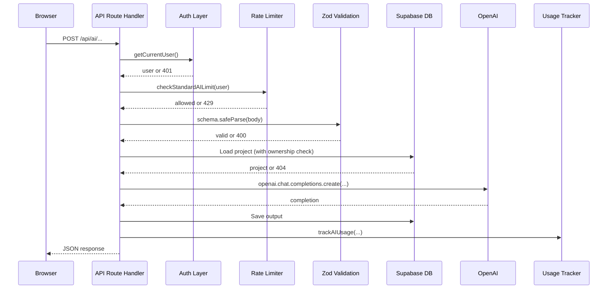

# System Overview

ProductMind is an AI-powered product management workspace. It helps product managers generate PRDs, prioritize features, analyze competitors, review decisions with evidence, and plan roadmaps — grounded in project context. Selected features (chat, roadmap, multi-agent review, decision review) use RAG to retrieve from uploaded feedback documents; others use project metadata directly.

## Architecture at a Glance

```
┌─────────────────────────────────────────────────────────┐
│                    Vercel (Serverless)                   │
│                                                         │
│  ┌──────────┐  ┌──────────────┐  ┌───────────────────┐  │
│  │ Next.js  │  │  API Routes  │  │  Service Layer    │  │
│  │ Pages    │  │  (REST-like) │  │  (lib/)           │  │
│  │ (React)  │──│  14 endpoints│──│  decisions/       │  │
│  │          │  │              │  │  rag/             │  │
│  │          │  │              │  │  evidence/        │  │
│  │          │  │              │  │  ai/              │  │
│  │          │  │              │  │  auth/            │  │
│  └──────────┘  └──────────────┘  └───────────────────┘  │
│                        │                    │            │
└────────────────────────┼────────────────────┼────────────┘
                         │                    │
              ┌──────────▼──────────┐  ┌──────▼──────┐
              │  Supabase           │  │  OpenAI     │
              │  - PostgreSQL + RLS │  │  - GPT-4o   │
              │  - pgvector         │  │  - Embed    │
              │  - Auth             │  │    3-small  │
              └─────────────────────┘  └─────────────┘
```

## Key Design Decisions

### Monolith in Next.js
All frontend, API routes, and service logic live in one Next.js app. This is intentional for an MVP — it simplifies deployment (single Vercel project) and development (shared types, no service mesh). The service layer (`src/lib/`) is modular enough to extract into separate services later.

### Supabase as Backend-as-a-Service
Supabase provides PostgreSQL, authentication, and row-level security (RLS) in one platform. Every table has RLS policies ensuring users can only access their own data. The pgvector extension enables semantic search for RAG.

### Server-Side AI Orchestration
All AI calls happen in API route handlers (server-side), never in the browser. This protects API keys, enables rate limiting, and allows complex multi-step orchestration (e.g., Decision Review's 10-phase pipeline).

### Mock / Real AI Toggle
The `USE_REAL_AI` environment variable switches between real OpenAI calls and deterministic mock outputs. This enables development without API costs and predictable testing.

## Feature Map

| Feature | API Route | Service Layer | Data Store |
|---|---|---|---|
| Project CRUD | Server Actions | `lib/validations/` | `projects` table |
| AI Chat (per-project) | `/api/ai/chat` | `lib/rag/` | `messages` table |
| AI Assistant (global) | `/api/ai/global-chat` | — | `global_chat_messages` |
| PRD Generator | `/api/ai/prd` | — | `decisions` table |
| Feature Prioritizer | `/api/ai/score-features` | — | `feature_ideas` table |
| AI Roadmap | `/api/ai/roadmap` | `lib/rag/` | `roadmaps` table |
| Competitive Analysis | `/api/ai/competitive-analysis` | — | `decisions` table |
| AI Insights | `/api/ai/insights` | — | `insights` table |
| Multi-Agent Review | `/api/ai/multi-agent-review` | `lib/rag/` | `multi_agent_reviews` table |
| Decision Engine | `/api/projects/*/decisions/*` | `lib/decisions/` | `product_decisions` + 6 related tables |
| Decision Review (AI) | `.../analyze` | `lib/decisions/decision-review-service.ts` | `product_*` tables |
| Evidence/RAG | Internal service | `lib/evidence/`, `lib/rag/` | `document_chunks` table |
| Usage Tracking | Internal service | `lib/ai/usage-tracking.ts` | `ai_usage` table |
| Rate Limiting | Middleware in routes | `lib/ai/rate-limiter.ts` | In-memory |
| Auth | Middleware + Supabase | `lib/auth/`, `lib/supabase/` | Supabase Auth |

## Request Lifecycle (Typical AI Route)



## Directory Structure

```
src/
├── app/                    # Next.js App Router pages + API routes
│   ├── (auth)/             # Auth pages (sign-in, sign-up, reset)
│   ├── (dashboard)/        # Protected dashboard pages
│   ├── api/                # REST-like API route handlers
│   └── auth/callback/      # Email confirmation + password reset callback
├── components/             # React UI components
│   └── ui/                 # Design system primitives
├── lib/                    # Service layer (backend logic)
│   ├── ai/                 # Rate limiting, usage tracking, pricing, mocks
│   ├── auth/               # Auth helpers, mock auth, admin checks
│   ├── decisions/          # Decision Engine services, schemas, normalization
│   ├── evidence/           # Evidence Layer (retrieval, citations, types)
│   ├── rag/                # RAG pipeline (chunking, embedding, search, context)
│   └── supabase/           # Supabase client (server, client, middleware; service-role via server.ts)
├── middleware.ts            # Edge middleware for session refresh
```

