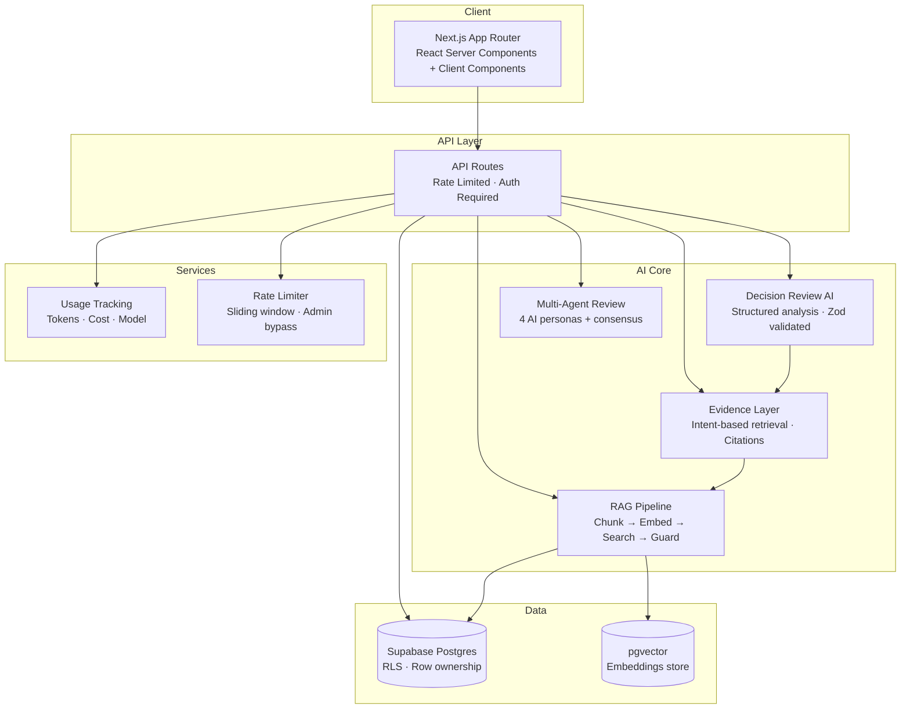

# ProductMind

**AI-powered product decision intelligence platform** for product managers, founders, and software teams.

ProductMind combines structured product management workflows with AI-powered analysis, RAG-based evidence retrieval, and multi-agent review to help teams make better product decisions — grounded in real user feedback, not gut feelings.

---

## Tech Stack

| Layer | Technology |
|---|---|
| Framework | Next.js 14 (App Router) |
| Language | TypeScript (strict) |
| Styling | Tailwind CSS 3 |
| Auth | Supabase Auth (email/password, email confirmation, password reset) |
| Database | Supabase Postgres + RLS |
| Vector Store | pgvector (cosine similarity) |
| Embeddings | OpenAI `text-embedding-3-small` |
| LLM | OpenAI GPT-4o |
| Validation | Zod (runtime schema validation for all AI outputs) |
| Deployment | Vercel (serverless) |

---

## Architecture Overview



### Design Principles

- **Project-scoped isolation** — all data and AI context is scoped to a single project; cross-project data leakage is prevented at the database (RLS), retrieval (project_id filter), and prompt level
- **AI outputs are validated, not trusted** — every structured AI response is parsed through Zod schemas before persistence; invalid JSON triggers one retry before failing gracefully
- **Mock-first development** — three flags (`USE_MOCK_AUTH`, `USE_MOCK_DB`, `USE_REAL_AI`) enable full local development without external services; production enforces real services at startup
- **Insert-before-delete** — re-analysis operations write new results before removing previous AI-generated content, preventing data loss on failure

---

## Core AI Pipeline

All AI features follow a consistent pipeline:

```
User Action
  → Auth check (Supabase session)
  → Rate limit check (sliding window, per-user)
  → Context assembly (project metadata + evidence retrieval)
  → OpenAI API call (GPT-4o, structured prompt)
  → Zod validation of response
  → Persist to Supabase
  → Track usage (tokens, cost, model, operation type)
  → Return to client
```

### AI Features

| Feature | Model | Output | Validation |
|---|---|---|---|
| Project Chat | GPT-4o | Streaming text | — |
| AI Insights | GPT-4o | Categorized insights (risk/opportunity/action/assumption) | Zod |
| PRD Generator | GPT-4o | Structured PRD sections | Zod |
| Competitive Analysis | GPT-4o | Positioning matrix + recommendations | Zod |
| Feature Scoring | GPT-4o | RICE/ICE scores per feature | Zod |
| Roadmap Generator | GPT-4o | Now/Next/Later + 30/60/90-day plan | Zod |
| Multi-Agent Review | GPT-4o | 4 persona reviews + consensus | Zod |
| Decision Review | GPT-4o | Options, assumptions, evidence, recommendation | Zod |

### Rate Limiting

In-memory sliding window limiter with two tiers:

| Tier | Limit | Routes |
|---|---|---|
| Standard | 20 req / hour | chat, insights, feature scoring |
| Heavy | 5 req / 15 min | PRD, roadmap, competitive analysis, multi-agent review |

Admin users (configured via `ADMIN_EMAILS` env var) bypass all rate limits.

> **Tradeoff**: In-memory limits reset per serverless instance. Acceptable for MVP; Redis/Upstash recommended for strict enforcement.

---

## RAG / Evidence Layer

### Ingestion

```
Feedback Document
  → Chunker (split by paragraphs, ~500 token chunks)
  → OpenAI text-embedding-3-small (1536 dimensions)
  → Store in document_chunks table (pgvector)
  → Indexed with project_id for scoped retrieval
```

### Retrieval (Hybrid Semantic + Lexical)

```
User Query / AI Prompt
  → Generate query embedding
  → pgvector cosine similarity search (match_document_chunks RPC)
  → Threshold degradation strategy (0.3 → 0.2 → 0.0) for diagnostics
  → Quality gate: MIN_PROMPT_SIMILARITY = 0.2 filters low-quality matches
  → Lexical guard: validates distinctive terms appear in chunk content
  → Project-scoped: only chunks from current project are searched
  → Assemble context for LLM prompt
```

**Why hybrid?** Pure semantic similarity produces false positives when chunks contain domain-generic language. The lexical guard catches cases where a chunk scores high on embedding similarity but contains none of the user's distinctive terms (e.g., product names, technical identifiers).

**Why threshold degradation?** Starting strict (0.3) and falling back to looser thresholds (0.2, then 0.0) ensures the system finds *something* when embeddings exist, while the quality gate prevents garbage from reaching the prompt.

### Evidence Layer

The Evidence Layer (`src/lib/evidence/`) wraps RAG into a reusable retrieval service used by multiple AI features:

- **Intent-based configuration** — each AI feature (chat, decision review, PRD generation) has its own retrieval config (max chunks, similarity threshold, prompt template)
- **`EvidenceCandidate` type** — standardized shape for retrieved evidence with similarity score, source metadata, and chunk content
- **Citation utilities** — format evidence into numbered citations for AI prompts and render citation references in UI

---

## Decision Review AI Flow

```
Analyze Decision (button click)
  → Load decision + project context from Supabase
  → Retrieve evidence via Evidence Layer (intent: decision_review)
  → Build structured prompt with decision context + evidence citations
  → GPT-4o generates: options, assumptions, risks, recommendation + confidence
  → Validate full response with Zod schema
  → Insert new AI-generated records (options, assumptions, evidence links, recommendation)
  → Delete previous AI-generated records (WHERE generated_by = 'ai')
  → Track usage (tokens, cost)
```

### Safety: `generated_by` Ownership

All AI-generated decision data is tagged with `generated_by = 'ai'`. Manual entries default to `'manual'`. Re-analysis only deletes `generated_by = 'ai'` rows — user-created content is never touched.

### Safety: Insert-Before-Delete

New AI results are inserted *before* old ones are deleted. If the insert fails, old data remains intact. This prevents the "blank state" failure mode where analysis fails and previous results are already gone.

---

## Security & Isolation

| Mechanism | Scope | Implementation |
|---|---|---|
| Row Level Security | All tables | Supabase RLS policies enforce `user_id = auth.uid()` |
| Project ownership | Child tables | JOIN through `projects` table to verify ownership |
| Route protection | All `/dashboard/*` | Middleware refreshes session; redirects unauthenticated users |
| API auth | All API routes | Server-side session check before processing |
| RAG isolation | Vector search | `project_id` filter in `match_document_chunks` RPC |
| Env guards | Production startup | Mock flags in production throw fatal errors |
| AI output validation | All structured AI | Zod schemas reject malformed LLM responses |
| Admin isolation | Rate limiter | Admin emails checked server-side only; never exposed to client |

---

## Current Implementation Status

### ✅ Implemented

- Project management (CRUD with structured metadata)
- Project context builder (personas, metrics, pain points, competitors, goals, constraints)
- Feedback documents (CRUD with source tagging)
- RAG pipeline (chunking → embedding → pgvector search → quality gates → lexical guard)
- Evidence retrieval layer (intent-based, project-scoped, with citations)
- AI Chat (streaming, project-scoped with RAG, global mode)
- AI Insights (risk, opportunity, assumption, action categories)
- PRD Generator (structured sections, persistence, detail view)
- Competitive Analysis (positioning, recommendations, persistence)
- Feature Ideas with RICE/ICE AI scoring
- AI Roadmap (Now/Next/Later, 30/60/90-day, risks, dependencies)
- Multi-Agent Review (PM, CTO, UX Researcher, Growth Marketer personas + consensus)
- Decision Engine (decisions CRUD, AI-powered analysis with structured outputs)
- AI usage tracking (tokens, cost, model, operation across all features)
- Rate limiting (sliding window, standard/heavy tiers, admin bypass)
- Supabase Auth (email/password, email confirmation, password reset, account deletion)
- RLS + project-scoped data isolation
- Zod validation on all structured AI outputs
- `generated_by` ownership tracking for safe re-analysis
- Cross-project isolation (DB, RAG, prompt level)
- Confidence scoring on AI recommendations
- Supabase persistence for all AI outputs
- Manual QA / smoke test plans
- Production safety guards (env validation, mock-mode blocking)

### 🚧 Planned / Not Yet Implemented

- Full multi-agent orchestration (agents currently run sequentially, not autonomously)
- Background job processing (all AI runs synchronously in request lifecycle)
- Streaming for structured AI outputs (only chat currently streams)
- Evaluation framework for AI output quality
- Autonomous agent workflows
- Production observability stack (structured logging, error tracking, APM)
- Redis-backed rate limiting for strict serverless enforcement
- PDF / Notion export for PRDs and roadmaps
- Team collaboration (multi-user projects)

---

## Features

- **Project Management** — Create, edit, and delete projects with structured metadata
- **Project Context Builder** — Personas, metrics, pain points, competitors, strategic goals, constraints
- **PRD Generator** — AI-generated product requirement documents with structured rendering
- **Feature Prioritizer** — RICE & ICE scoring with AI-powered estimation
- **Competitive Analysis** — Competitive landscape, positioning insights, strategic recommendations
- **AI Insights** — Strategic insights across risk, opportunity, assumption, and action categories
- **Product Roadmap** — Now/Next/Later roadmap with 30/60/90-day plans, risks, dependencies
- **Multi-Agent Review** — Four AI personas review product decisions with consensus summary
- **Decision Engine** — AI-powered decision analysis with options, assumptions, evidence, and confidence scoring
- **Evidence Layer** — Intent-based retrieval with quality gates, citations, and project scoping
- **AI Chat** — Streaming chat with RAG context (global + project-scoped)
- **Feedback & Research** — Customer feedback collection with source tagging and RAG ingestion
- **AI Usage Tracking** — Token, cost, and operation monitoring across all AI features
- **Authentication** — Supabase Auth with email/password, email confirmation, password reset, account deletion
- **Rate Limiting** — Per-user AI rate limiting with admin bypass
- **Settings** — Profile management, account security, account deletion

---

## Project Structure

```
src/
├── app/
│   ├── (auth)/                    # Sign-in, sign-up pages
│   ├── (dashboard)/               # Protected dashboard layout
│   │   ├── dashboard/             # Dashboard homepage
│   │   ├── projects/[id]/         # Project detail + AI tools
│   │   │   ├── prd/               # PRD generator + detail view
│   │   │   ├── analysis/          # Competitive analysis + detail
│   │   │   ├── features/          # Feature ideas + RICE/ICE scoring
│   │   │   ├── insights/          # AI strategic insights
│   │   │   ├── roadmap/           # AI roadmap generator
│   │   │   ├── multi-agent-review/# Multi-persona review
│   │   │   ├── chat/              # Project-scoped AI chat
│   │   │   ├── decisions/         # Decision Engine + AI analysis
│   │   │   ├── feedback/          # Feedback documents CRUD
│   │   │   └── context/           # Project context builder
│   │   ├── ai-chat/               # Global AI assistant
│   │   ├── usage/                 # AI usage history
│   │   └── settings/              # User settings
│   ├── api/
│   │   ├── ai/                    # AI API routes (chat, insights, PRD, etc.)
│   │   ├── decisions/             # Decision Engine API
│   │   └── projects/              # Project API routes
│   ├── auth/callback/             # Supabase email confirmation callback
│   └── page.tsx                   # Marketing landing page
├── components/
│   ├── ui/                        # Reusable UI primitives
│   ├── chat-shell.tsx             # Shared streaming chat component
│   └── document-renderer.tsx      # Markdown-to-cards renderer
├── lib/
│   ├── ai/                        # AI utilities (pricing, tracking, rate limiter, mock generators)
│   ├── decisions/                 # Decision Engine (service, schemas, review AI)
│   ├── evidence/                  # Evidence Layer (retrieval, citations, intent configs)
│   ├── rag/                       # RAG pipeline (chunking, embeddings, vector search, context builder)
│   ├── supabase/                  # Supabase clients (server, browser)
│   ├── auth/                      # Auth helpers
│   ├── env.ts                     # Runtime environment validation
│   └── openai.ts                  # OpenAI client singleton
├── services/                      # Data access services
├── types/                         # Shared TypeScript types
└── middleware.ts                  # Auth session refresh + route protection
```

---

## Local Development

### Prerequisites

- Node.js 18+
- Supabase project ([supabase.com](https://supabase.com) — free tier works)
- OpenAI API key ([platform.openai.com](https://platform.openai.com))

### Setup

```bash
git clone <repo-url> && cd project-mind
npm install
cp .env.local.example .env.local   # Fill in your values
npm run dev                        # http://localhost:3000
```

### Database Migrations

Run in order via **Supabase Dashboard → SQL Editor**. See [DEPLOYMENT.md](./DEPLOYMENT.md) for the full migration list and verification queries.

### Development Modes

| Mode | Config | Use Case |
|---|---|---|
| **Full mock** | `USE_MOCK_AUTH=true` `USE_MOCK_DB=true` `USE_REAL_AI=false` | No external services needed |
| **Mock auth + real AI** | `USE_MOCK_AUTH=true` `USE_MOCK_DB=true` `USE_REAL_AI=true` | Test AI features without Supabase |
| **Full production** | Real Supabase + OpenAI credentials | End-to-end testing |

---

## Environment Variables

```env
# Supabase
NEXT_PUBLIC_SUPABASE_URL=https://your-project.supabase.co
NEXT_PUBLIC_SUPABASE_ANON_KEY=your-anon-key
SUPABASE_SERVICE_ROLE_KEY=your-service-role-key

# OpenAI
OPENAI_API_KEY=sk-...

# App
NEXT_PUBLIC_SITE_URL=http://localhost:3000

# Development flags (set all to false/true for production)
NEXT_PUBLIC_USE_MOCK_AUTH=true
USE_MOCK_AUTH=true
USE_MOCK_DB=false
USE_REAL_AI=false

# Admin (optional, server-only)
ADMIN_EMAILS=admin@example.com,another@example.com
```

---

## Scripts

| Command | Description |
|---|---|
| `npm run dev` | Start development server |
| `npm run build` | Production build |
| `npm run lint` | Run ESLint |
| `npm run lint:fix` | Fix ESLint issues |
| `npm run format` | Format with Prettier |
| `npm run format:check` | Check formatting |

---

## Deployment

See [DEPLOYMENT.md](./DEPLOYMENT.md) for the full deployment guide including:

- Vercel environment variables
- Supabase Auth URL configuration
- Database migration order
- Production safety guards
- Custom domain setup (LH.pl)
- Post-deploy smoke test checklist
- Troubleshooting guide

---

## License

Private — not open source.

